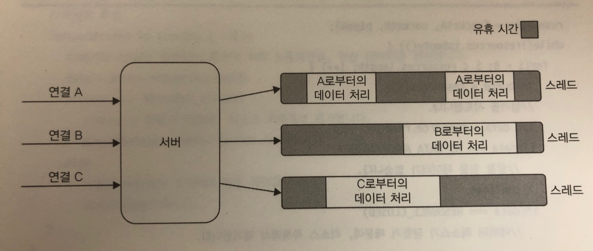

# Welcome Node.js Platform
<hr>

## 1.1 Node.js 철학

### - 경량코어

### - 경량 모듈
*작은 것이 아름답다.<br>*
*각 프로그램이 각기 한 가지 역할을 잘 하도록 만든다.*

**작은 모듈 장점**
0. 재사용성
1. 이해하기 쉽고 사용하기 쉽다.
2. 테스트 및 유지보수가 훨씬 간단하다.
3. 브라우저와 완벽한 공유가 가능하다.

> **DRY**  (Don't Repeat Youself ㅋㅋㅋㅋㅋ)

### - 작은 외부 인터페이스
Node.js 모듈은 크기와 범위가 작을 뿐만 아니라 대개 최소한의 기능을 노출하는 특성을 가지고 있음<br>
-> API의 유용성이 향상됨 (API 사용이 보다 명확해지고 잘못된 사용에 덜 노출됨)

Node.js에서 모듈을 정의하는 가장 일반적인 패턴<br>
함수나 생성자와 같이 하나의 핵심 기능을 표현하는 동시에, 더 많은 고급기능이나 보조 기능은 노출된 함수나 생성자의 속성이 되도록 한다.

단순히 확장하는 용도보다는 실제 사용하도록 만들어짐.


### - 간결함과 실용주의
>*KISS (Keep It Simple, Stupid)* <br>

>*단순함이야말로 궁극의 정교함이다.*

<hr>

## 1.2 Node.js 6와 ES2015에 대한 소개

### - let & const

### - 화살표 함수(arrow function)
화살표함수는 항상 익명이다.

그리고 어휘 범위(lexical scope)로 바인드 된다. 즉, 화살표 함수 내부의 this값은 부모 블록의 값과 같다.
```javascript
const numbers = [2,6,7,8,1];
const even = numbers.filter(function(x) {
    return x%2 === 0;
})
```
```javascript
const numbers = [2,6,7,8,1];
const even = numbers.filter(x => x%2 === 0);
```
```javascript
const numbers = [2,6,7,8,1];
const even = numbers.filter(x => {
    if(x%2 === 0){      // == 보다는 ===을 사용하는 습관을 들이자!
        console.log(x + 'is 짝수!')
        return true
    }
});
```

### - 클래스 구문
```javascript
// 프로토타입 기반의 Person 함수
function Person(name, surname, age) {
    this.name = name;
    this.surname = surname;
    this.age = age;
}

Person.prototype.getFullName = function () {
    return this.name + '' + this.surname;
};

Person.older = function (person1, person2) {
    return (person1.age >= person2.age) ? person1 : person2;
}
```

```javascript
// ES2015 클래스 구문을 사용한 Person 함수
class Person {
    constructor (name, surname, age) {
        this.name = name;
        this.surname = surname;
        this.age = age;
    }
    
    getFullName () {
        return this.name + '' + this.surname;
    };
    
    static older (person1, person2) {
        return (person1.age >= person2.age) ? person1 : person2;
    }
}
```

static 메서드는 정적 메서드로 클래스의 인스턴스 없이 호출이 가능하며 클래스가 인스턴스화되면 호출할 수 없다.<br>
정적 메서드는 종종 어플리케이션의 유틸리티 함수를 만드는데 사용됨.

### - 향상된 객체 리터럴
변수 및 함수를 객체의 멤버로 지정하고, 객체를 생성할 때 동적인 멤버명을 정의할 수 있도록 하며, 편리한 setter 및 getter 함수를 제공한다.

```javascript
const x = 22;
const y = 17;
const obj = { x,y }
```
```javascript
// function 키워드를 지정할 필요가 없음
module.exports = {
    square (x) {
        return x * x;
    },
    cube (x) {
        return x * x * x;
    }
}
```
```javascript
// 동적으로 속성 명을 사용 -> 프론트에서 사용하기 좋은건가...?
const namespace = '-webkit-'
const style = {
    [namespace + 'box-sizing'] : 'border-box',
    [namespace + 'box-sizing'] : '10px10px5px #888888',
}
```
```javascript
// setter 랑 getter
const person = {
    name: 'George',
    surname: 'Boole',
    
    get fullname () {
        return this.name + '' + this.surname
    },
    
    set fullname(fullname) {
        let parts = fullname.split('');
        this.name = parts[0];
        this.surname = parts[1];
    }
};

console.log(person.fullname); // "George Boole"
console.log(person.fullname = 'Alan Turing'); // "Alan Turing"
console.log(person.name); // "Alan"
```

### - Map과 Set Collection
[참고자료 - Map과 Set 정리](https://ko.javascript.info/map-set)


### - WeakMap 및 WeakSet Collection
WeakMap은 Map과 비슷하다. WeakMap은 가지고 있는 요소 전체를 반복 구문으로 탐색할 방법이 없으며, 객체 만을 키로 가질 수 있다.

WeakMap의 특징은 키로 사용된 객체에 대한 유일한 참조가 WeakMap 내에서만 남아 있을 경우, 이 객체를 GC(Garbage Collect)할 수 있다는 것이다.
```javascript
let obj = {};
const map = new WeakMap();
map.set(obj, {key: "some_value"});
console.log(map.get(obj)); // {key: "some_value"}
obj = undefined;
// 다음 GC 사이클에서 맵에 관련도니 객체와 데이터가 정리됨
```

WeakSet 또한 WeakSet 내 유일 참조가 남을 경우 해당 객체를 GC 할 수 있다는 것이다.
```javascript
let obj1 = {key: "val1"}
let obj2 = {key: "val2"}
const set = new WeakSet([obj1, obj2]);
console.log(set.has(obj1)) // true
obj1 = undefined // 이제 obj1이 set에서 제거됨
console.log(set.has(obj1)) // false
```
[참고자료 - WeakMap과 WeakSet 정리](https://ko.javascript.info/weakmap-weakset)

### - Template 표기법
`` 사용. 템플릿 표기 구문을 문자열 내에서 ${}의 형식으로 사용하여 변수 또는 표현식 삽입 가능.
```javascript
const name = "MinSoo"
const text = `My name is ${name}`
console.log(text); // "My name is MinSoo"
```

<hr>

## 1.3 Reactor 패턴
Reactor 패턴은 Node.js의 비동기 특성의 핵심이다.

### - I/O는 속도가 느리다.
I/O는 컴퓨터의 기본적인 동작 중에서 가장 느리다. I/O는 일반적으로 CPU측면에서 비용이 많이 들지 않지만, 요청을 보낸 순간부터 작업이 완료되는 순가까지 지연을 동반하게 된다. 

### - 블로킹 I/O
전통적인 블로킹 I/O 프로그래밍에서는 I/O 요청에 해당하는 함수 호출은 작업이 완료될 때까지 스레드의 실행이 차단된다.
```javascript
// 데이터를 사용할 수 있을 때까지 스레드가 블록됨.
data = socket.read();
// 데이터 사용 가능
print(data);
```

각 소켓에서의 모든 I/O 작업이 다른 연결 처리를 차단할 것이기 때문에, 블로킹 I/O를 사용하여 구현된 웹 서버가 동일한 스레드에서 여러 연결을 처리할 수는 없다.

그렇기에 웹 서버에서 동시성을 처리하기 위한 전통적인 접근 방식은 처리해야 하는 각가의 동시 연결에 대해 새로운 스레드 또는 프로세스를 시작하거나 풀에서 가져온 스레드를 재사용 하는 것이다.

이렇게 해서 스레드가 I/O 작업으로 차단되어도 분리된 스레드에서 처리되므로 다른 요청의 가용성에는 영향을 미치지 않는다.

{: width='100' height='100'}

{: width="100" height="100"}